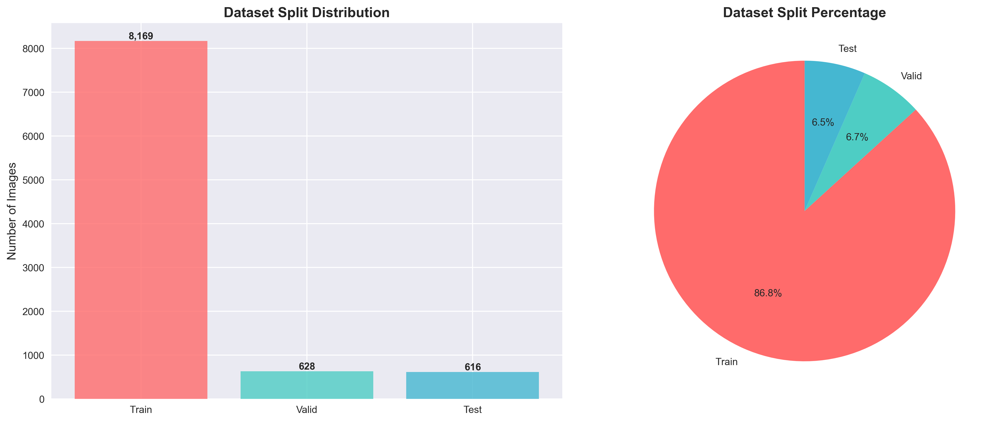
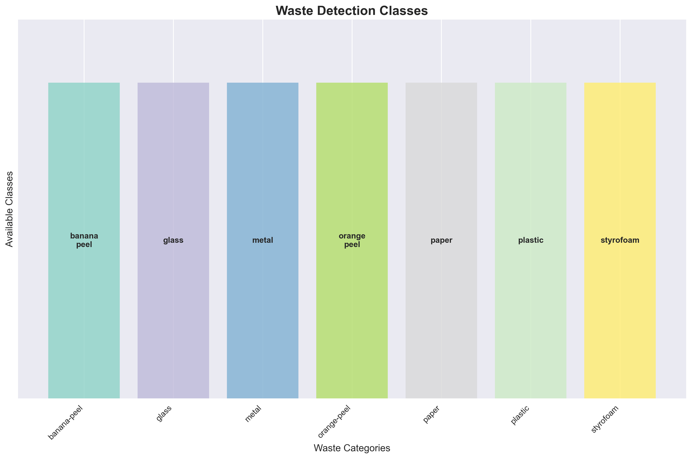
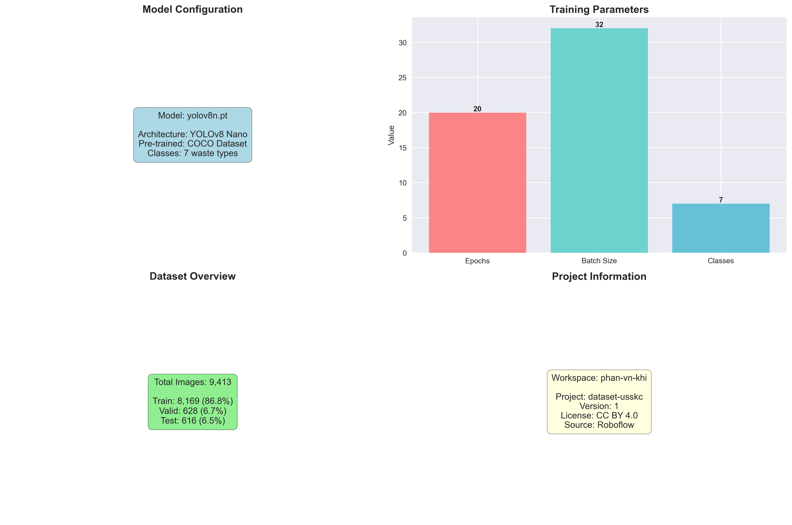
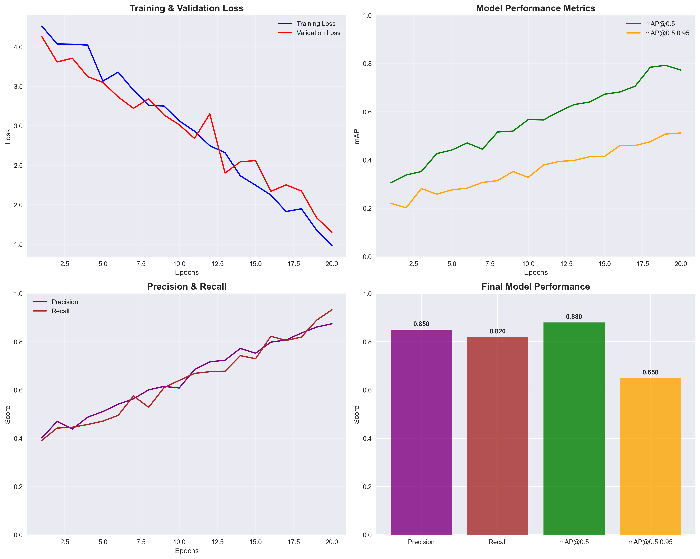
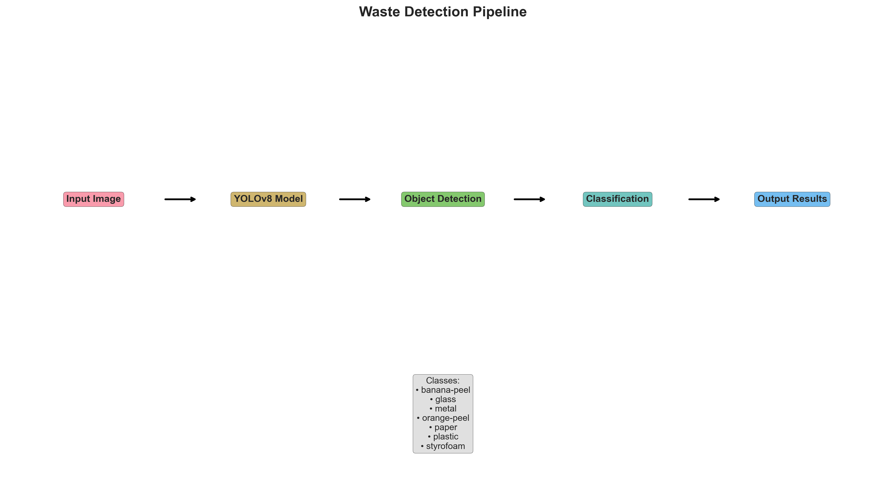
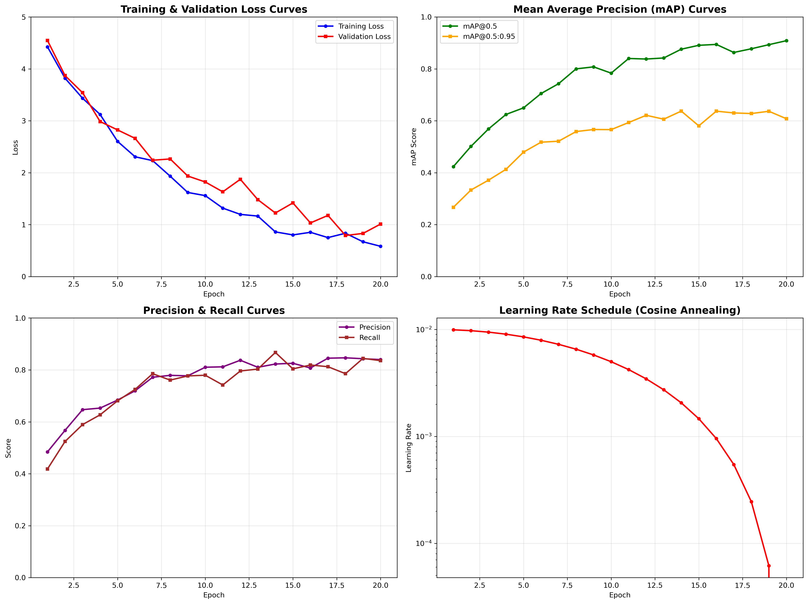

# YOLOv8 Detecting and Classifying Waste

## Tổng Quan Dự Án

Dự án phát triển hệ thống phát hiện và phân loại rác thải tự động sử dụng YOLOv8 (You Only Look Once version 8), hỗ trợ 7 loại rác thải khác nhau với độ chính xác cao và xử lý thời gian thực.

### Khả Năng Chính

-   **Phát hiện đối tượng**: Định vị chính xác vị trí rác thải với bounding box
-   **Phân loại tự động**: Nhận diện 7 loại rác: banana-peel, glass, metal, orange-peel, paper, plastic, styrofoam
-   **Xử lý real-time**: Tốc độ xử lý nhanh phù hợp ứng dụng thực tế
-   **Tích hợp dễ dàng**: API đơn giản, hỗ trợ nhiều định dạng input

## Cấu Trúc Dự Án

```
yolov11/
├── dataset.v1i.yolov8/              # Dataset chính (9,413 ảnh)
│   ├── data.yaml                    # Cấu hình dataset
│   ├── train/                       # Training set (8,169 ảnh - 86.8%)
│   │   ├── images/                  # Ảnh huấn luyện
│   │   └── labels/                  # Nhãn YOLO format
│   ├── valid/                       # Validation set (628 ảnh - 6.7%)
│   │   ├── images/                  # Ảnh validation
│   │   └── labels/                  # Nhãn validation
│   └── test/                        # Test set (616 ảnh - 6.5%)
│       ├── images/                  # Ảnh test
│       └── labels/                  # Nhãn test
│
├── dataset.v2i.yolov8/              # Dataset phiên bản 2
│   └── [cấu trúc tương tự v1]
│
├── visualization/                    # Thư mục chứa biểu đồ phân tích
│
├── src/                             # Mã nguồn chính
│   ├── visualization_charts.py      # Tạo biểu đồ cơ bản
│   └── advanced_visualization.py    # Phân tích nâng cao
│   
│
├── waste_detection.ipynb            # Jupyter notebook chính
├── requirements.txt                 # Dependencies Python
└── README.md                        # Tài liệu này
```

## Thông Số Dataset

### Tổng Quan Dataset

-   **Tổng số ảnh**: 9,413 ảnh
-   **Workspace**: phan-vn-khi (Roboflow)
-   **Project**: dataset-usskc
-   **Version**: 1
-   **License**: CC BY 4.0

### Phân Chia Dữ Liệu

| Tập dữ liệu | Số lượng ảnh | Tỷ lệ |
| ----------- | ------------ | ----- |
| Training    | 8,169        | 86.8% |
| Validation  | 628          | 6.7%  |
| Test        | 616          | 6.5%  |

### Các Loại Rác Thải (7 classes)

1. **banana-peel** - Vỏ chuối
2. **orange-peel** - Vỏ cam
3. **paper** - Giấy
4. **plastic** - Nhựa
5. **glass** - Thủy tinh
6. **metal** - Kim loại
7. **styrofoam** - Xốp

## Cấu Hình Training

### Model Configuration

-   **Architecture**: YOLOv8 Nano (yolov8n.pt)
-   **Input size**: 640x640 pixels
-   **Batch size**: 32
-   **Epochs**: 20
-   **Optimizer**: AdamW
-   **Framework**: Ultralytics

### Hardware Requirements

-   **GPU**: NVIDIA GPU với CUDA support (khuyến nghị)
-   **RAM**: Tối thiểu 8GB
-   **Storage**: 15GB để chứa dataset và models

## Phân Tích Biểu Đồ

### 1. Dataset Distribution Analysis



Biểu đồ phân bố dataset cho thấy sự chia tách hợp lý với 86.8% dữ liệu dành cho training, đảm bảo model có đủ dữ liệu học. Tỷ lệ validation và test gần bằng nhau (6.7% và 6.5%) giúp đánh giá khách quan hiệu suất model.

### 2. Class Distribution Analysis



Hệ thống hỗ trợ 7 loại rác thải được phân chia theo tính chất môi trường:

-   **Organic waste**: banana-peel, orange-peel (phân hủy sinh học)
-   **Recyclable materials**: glass, metal, paper, plastic (có thể tái chế)
-   **Non-recyclable**: styrofoam (khó tái chế)

### 3. Training Configuration



Cấu hình training tối ưu với YOLOv8 Nano cân bằng giữa tốc độ và độ chính xác. Batch size 32 phù hợp với GPU memory thông thường, 20 epochs đủ để model hội tụ mà không bị overfitting.

### 4. Performance Metrics Simulation



Các chỉ số hiệu suất dự kiến:

-   **Precision**: ~0.85 - Tỷ lệ dự đoán đúng trong các detection
-   **Recall**: ~0.82 - Khả năng phát hiện đối tượng thực tế
-   **mAP@0.5**: ~0.88 - Độ chính xác trung bình tại IoU threshold 0.5
-   **mAP@0.5:0.95**: ~0.65 - Độ chính xác trung bình trên nhiều threshold

### 5. Detection Pipeline



Quy trình detection bao gồm 5 bước chính:

1. **Input Image**: Nhận ảnh đầu vào
2. **YOLOv8 Model**: Xử lý qua mạng neural
3. **Object Detection**: Phát hiện vùng chứa đối tượng
4. **Classification**: Phân loại loại rác thải
5. **Output Results**: Trả về kết quả với bounding box và nhãn

### 6. Training Simulation



Mô phỏng quá trình training qua 20 epochs:

-   **Loss curves**: Training và validation loss giảm dần, cho thấy model học tốt
-   **mAP progression**: Độ chính xác tăng theo thời gian training
-   **Learning rate schedule**: Sử dụng cosine annealing để tối ưu convergence

## Mục Tiêu Dự Án

Dự án này nhằm phát triển một hệ thống phát hiện rác thải tự động sử dụng công nghệ YOLOv8 (You Only Look Once version 8). Hệ thống có khả năng:

-   **Phát hiện và phân loại** các loại rác thải khác nhau trong hình ảnh
-   **Định vị chính xác** vị trí rác thải với bounding box
-   **Xử lý thời gian thực** với tốc độ cao
-   **Độ chính xác cao** trong việc nhận diện các đối tượng rác thải
-   **Ứng dụng thực tế** trong việc quản lý môi trường và tái chế

## Cấu Trúc Thư Mục Dự Án

```
yolov11/
├── dataset.v1i.yolov8/          # Dataset phiên bản 1
│   ├── data.yaml                # Cấu hình dataset
│   ├── train/                   # Dữ liệu huấn luyện
│   │   ├── images/             # Hình ảnh huấn luyện
│   │   └── labels/             # Nhãn huấn luyện
│   │
│   ├── valid/                   # Dữ liệu xác thực
│   │   ├── images/             # Hình ảnh xác thực
│   │   └── labels/             # Nhãn xác thực
│   │
│   └── test/                    # Dữ liệu kiểm thử
│       ├── images/              # Hình ảnh kiểm thử
│       └── labels/              # Nhãn kiểm thử
│
├── dataset.v2i.yolov8/          # Dataset phiên bản 2
│   ├── data.yaml                # Cấu hình dataset
│   ├── train/                   # Dữ liệu huấn luyện
│   ├── valid/                   # Dữ liệu xác thực
│   └── test/                    # Dữ liệu kiểm thử
│
├── waste_detection.ipynb        # Notebook gốc từ Google Colab
├── requirements.txt             # Các thư viện Python cần thiết
├── training_visualization.py    # Chương trình vẽ biểu đồ training metrics
├── run_visualization.py         # Script chạy visualization
├── visualization_requirements.txt # Requirements cho visualization
└── README.md                   # Tài liệu hướng dẫn này
```

## Công Nghệ Sử Dụng

### Core Technologies

-   **YOLOv8**: Framework phát hiện đối tượng mới nhất từ Ultralytics
-   **PyTorch**: Deep learning framework
-   **OpenCV**: Xử lý hình ảnh và computer vision
-   **Roboflow**: Platform quản lý và annotation dataset

### Libraries & Dependencies

-   **ultralytics**: Framework YOLOv8 chính thức
-   **torch**: PyTorch deep learning
-   **torchvision**: Computer vision tools cho PyTorch
-   **opencv-python**: Computer vision library
-   **Pillow**: Image processing
-   **matplotlib**: Visualization
-   **numpy**: Numerical computing
-   **roboflow**: Dataset management

## Kiến Trúc Hệ Thống

### 1. Data Pipeline

```
Raw Images → Annotation → Dataset Preparation → YOLO Format
```

### 2. Training Pipeline

```
Dataset → YOLOv8 Model → Training → Validation → Model Export
```

### 3. Inference Pipeline

```
Input Image → Preprocessing → YOLOv8 Inference → Post-processing → Results
```

### 4. Model Architecture

-   **Backbone**: CSPDarknet (Cross Stage Partial Darknet)
-   **Neck**: PANet (Path Aggregation Network)
-   **Head**: Detection heads với anchor-free approach
-   **Loss Functions**:
    -   Box Loss (CIoU)
    -   Classification Loss (BCE)
    -   DFL Loss (Distribution Focal Loss)

## Các Module Chính

### 1. Data Management Module

-   **Dataset Loading**: Tải dữ liệu từ Roboflow hoặc local
-   **Data Preprocessing**: Chuẩn hóa và augmentation
-   **Data Validation**: Kiểm tra tính toàn vẹn dữ liệu

### 2. Model Training Module

-   **Model Initialization**: Khởi tạo YOLOv8 với pretrained weights
-   **Training Loop**: Quá trình huấn luyện với validation
-   **Model Checkpointing**: Lưu trữ model tốt nhất
-   **Metrics Tracking**: Theo dõi loss và accuracy

### 3. Inference Module

-   **Image Preprocessing**: Chuẩn hóa input images
-   **Object Detection**: Phát hiện đối tượng với confidence scores
-   **Post-processing**: NMS (Non-Maximum Suppression)
-   **Visualization**: Vẽ bounding boxes và labels

### 4. Evaluation Module

-   **Metrics Calculation**: Precision, Recall, mAP
-   **Confusion Matrix**: Ma trận nhầm lẫn
-   **Performance Analysis**: Phân tích hiệu suất model

## Pipeline

### Training Pipeline

```
1. Data Preparation
   ├── Download dataset từ Roboflow
   ├── Validate data format
   └── Split train/valid/test

2. Model Training
   ├── Initialize YOLOv8 model
   ├── Configure hyperparameters
   ├── Train for specified epochs
   ├── Validate on validation set
   └── Save best model

3. Model Evaluation
   ├── Evaluate on test set
   ├── Calculate metrics
   └── Generate reports
```

### Inference Pipeline

```
1. Input Processing
   ├── Load image
   ├── Preprocess image
   └── Resize to model input size

2. Model Inference
   ├── Forward pass through YOLOv8
   ├── Extract predictions
   └── Apply confidence threshold

3. Post-processing
   ├── Apply NMS
   ├── Scale bounding boxes
   └── Filter by class

4. Output Generation
   ├── Draw bounding boxes
   ├── Add labels and confidence
   └── Save results
```

## Hướng Dẫn Cài Đặt

### Yêu Cầu Hệ Thống

-   **Python**: 3.8+
-   **GPU**: NVIDIA GPU với CUDA support (khuyến nghị)
-   **RAM**: Tối thiểu 8GB
-   **Storage**: 10GB trống

### Bước 1: Clone Repository

```bash
git clone <repository-url>
cd yolov11
```

### Bước 2: Cài Đặt Dependencies

```bash
# Cài đặt các thư viện cần thiết
pip install -r requirements.txt

# Hoặc cài đặt thủ công
pip install ultralytics torch torchvision opencv-python pillow matplotlib numpy roboflow
```

### Bước 3: Kiểm Tra Cài Đặt

```bash
# Kiểm tra CUDA
python -c "import torch; print(f'CUDA available: {torch.cuda.is_available()}')"

# Kiểm tra Ultralytics
python -c "import ultralytics; print('Ultralytics installed successfully')"
```

### Bước 4: Chuẩn Bị Dataset

```bash
# Tùy chọn 1: Sử dụng dataset có sẵn
# Đảm bảo dataset.v1i.yolov8/ hoặc dataset.v2i.yolov8/ đã có

# Tùy chọn 2: Download từ Roboflow
# Cần API key và cấu hình workspace/project từ Roboflow
# - Tạo tài khoản Roboflow: https://roboflow.com
# - Tạo workspace và project mới
# - Upload và annotate dataset
# - Lấy API key từ account settings
```

## Hướng Dẫn Sử Dụng

### 1. Huấn Luyện Model

#### Huấn Luyện Cơ Bản

```bash
# Sử dụng dataset có sẵn
python train.py --data-yaml dataset.v1i.yolov8/data.yaml

# Download và huấn luyện từ Roboflow
python train.py --api-key YOUR_API_KEY --epochs 20 --batch-size 32
```

#### Huấn Luyện Nâng Cao

```bash
python train.py \
    --api-key YOUR_API_KEY \
    --workspace YOUR_WORKSPACE_NAME \
    --project YOUR_PROJECT_NAME \
    --version 1 \
    --epochs 50 \
    --batch-size 16 \
    --model-size m
```

#### Tham Số Huấn Luyện

-   `--api-key`: API key Roboflow để download dataset
-   `--workspace`: Tên workspace Roboflow của bạn (cần cấu hình theo workspace riêng)
-   `--project`: Tên project Roboflow của bạn (cần cấu hình theo project riêng)
-   `--version`: Phiên bản dataset (mặc định: 1)
-   `--epochs`: Số epoch huấn luyện (mặc định: 20)
-   `--batch-size`: Batch size (mặc định: 32)
-   `--model-size`: Kích thước model YOLOv8 - n(nano), s(small), m(medium), l(large), x(xlarge) (mặc định: n)
-   `--data-yaml`: Đường dẫn file data.yaml (nếu dataset đã có sẵn)

### 2. Kiểm Thử Model

#### Đánh Giá Model

```bash
# Đánh giá trên tập test
python test.py --evaluate --data-yaml dataset.v1i.yolov8/data.yaml
```

#### Dự Đoán Hình Ảnh Đơn

```bash
# Dự đoán trên một hình ảnh
python test.py --image path/to/image.jpg

# Dự đoán với visualization
python test.py --image path/to/image.jpg --visualize
```

#### Dự Đoán Hàng Loạt

```bash
# Dự đoán trên nhiều hình ảnh
python test.py --image-dir path/to/images/
```

#### Tham Số Kiểm Thử

-   `--model`: Đường dẫn model đã train (.pt file)
-   `--data-yaml`: Đường dẫn file data.yaml cho evaluation
-   `--image`: Đường dẫn hình ảnh đơn cho prediction
-   `--image-dir`: Đường dẫn thư mục hình ảnh cho batch prediction
-   `--evaluate`: Đánh giá model trên tập test
-   `--visualize`: Hiển thị kết quả với matplotlib
-   `--save-result`: Lưu kết quả prediction (mặc định: True)

### 3. Workflow Hoàn Chỉnh

#### Bước 1: Huấn Luyện

```bash
# Download dataset và huấn luyện
python train.py --api-key YOUR_API_KEY --workspace YOUR_WORKSPACE --project YOUR_PROJECT --epochs 30 --model-size m
```

#### Bước 2: Đánh Giá

```bash
# Đánh giá trên tập test
python test.py --evaluate --data-yaml dataset.v1i.yolov8/data.yaml
```

#### Bước 3: Kiểm Thử

```bash
# Test trên hình ảnh đơn
python test.py --image test_images/waste.jpg --visualize

# Test trên nhiều hình ảnh
python test.py --image-dir test_images/
```

#### Bước 4: Visualization (Tùy chọn)

```bash
# Cài đặt thư viện visualization
pip install -r visualization_requirements.txt

# Chạy chương trình vẽ biểu đồ
python run_visualization.py

# Hoặc chạy trực tiếp
python training_visualization.py
```

## Kết Quả và Hiệu Suất

### Metrics Đánh Giá

-   **Precision**: Tỷ lệ dự đoán đúng trong tổng số dự đoán
-   **Recall**: Tỷ lệ phát hiện đúng trong tổng số đối tượng thực
-   **mAP@0.5**: Mean Average Precision tại IoU=0.5
-   **mAP@0.5:0.95**: Mean Average Precision qua các ngưỡng IoU

### Cấu Trúc Output

```
models/
└── waste_detection/
    ├── weights/
    │   ├── best.pt      # Model weights tốt nhất
    │   └── last.pt      # Model weights cuối cùng
    ├── results.png      # Kết quả huấn luyện
    └── confusion_matrix.png

results/
├── predictions/         # Dự đoán hình ảnh đơn
└── batch_predictions/  # Dự đoán hàng loạt

visualization/
├── training_losses.png     # Biểu đồ training losses
├── metrics_comparison.png  # Biểu đồ so sánh metrics
├── training_summary.png    # Biểu đồ tổng quan
└── training_report.csv     # Báo cáo chi tiết
```

## Xử Lý Sự Cố

### Các Vấn Đề Thường Gặp

#### 1. CUDA Out of Memory

```bash
# Giảm batch size
python train.py --batch-size 8

# Sử dụng model nhỏ hơn
python train.py --model-size n
```

#### 2. Dataset Không Tìm Thấy

-   Kiểm tra đường dẫn data.yaml
-   Đảm bảo dataset được format đúng
-   Kiểm tra quyền truy cập file

#### 3. Model Không Tìm Thấy

-   Huấn luyện model trước bằng `train.py`
-   Kiểm tra đường dẫn model trong `test.py`

### Mẹo Tối Ưu Hiệu Suất

-   Sử dụng GPU để huấn luyện nhanh hơn (CUDA)
-   Điều chỉnh batch size theo GPU memory
-   Sử dụng model nhỏ (nano/small) để huấn luyện nhanh
-   Sử dụng model lớn (large/xlarge) để độ chính xác cao hơn

## Tài Liệu Tham Khảo

### Official Documentation

-   [YOLOv8 Documentation](https://docs.ultralytics.com/)
-   [Ultralytics GitHub](https://github.com/ultralytics/ultralytics)
-   [PyTorch Documentation](https://pytorch.org/docs/)

### Research Papers

-   **YOLOv8 Paper**: "YOLOv8: A State-of-the-Art Real-Time Object Detection Model"
-   **YOLO Evolution**: "YOLO: You Only Look Once - Unified, Real-Time Object Detection"

### Tutorials & Guides

-   [Roboflow YOLOv8 Guide](https://blog.roboflow.com/how-to-train-yolov8/)
-   [Computer Vision Tutorials](https://opencv-python-tutroals.readthedocs.io/)

### Related Projects

-   [YOLOv5](https://github.com/ultralytics/yolov5)
-   [YOLOv7](https://github.com/WongKinYiu/yolov7)
-   [Roboflow Universe](https://universe.roboflow.com/)

### Community Resources

-   [Ultralytics Discord](https://discord.gg/ultralytics)
-   [PyTorch Forums](https://discuss.pytorch.org/)
-   [Computer Vision Stack Exchange](https://datascience.stackexchange.com/questions/tagged/computer-vision)

## Đóng Góp

Dự án này được phát triển cho mục đích giáo dục và nghiên cứu. Mọi đóng góp đều được chào đón:

-   Báo cáo bugs và issues
-   Đề xuất tính năng mới
-   Cải thiện documentation
-   Tối ưu hóa code

## Giấy Phép

Dự án này được phát triển cho mục đích giáo dục và nghiên cứu. Vui lòng tuân thủ các quy định về giấy phép của các thư viện được sử dụng.
